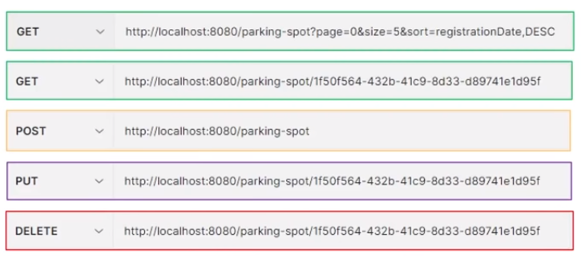

<h1 align="center"> Parking Control API</h1>

Desenvolvimento do backend para um sistema de gerenciamento de vagas de estacionamento em condomínio. 
O projeto foi desenvolvido no Framework Spring utilizando a arquitetura API Rest e a comunicação com o banco de dados PostgreSQL. 

 
<h2> 🛠 Tecnologias: </h2>

As seguintes ferramentas foram usadas na construção do projeto:

<!-- 
 -->

### 💬 Assuntos abordados:
- Criação de API Java com Arquitetura REST 
- Métodos getAll, getOne, post, delete, update 
- Inversão de Controle 
- Injeção de Dependências
- Beans
- Spring Boot
- Spring MVC
- Spring Data JPA 
- Spring Validation
- API com Pageable
<!-- - Spring Security (JWT)
- Deploy da aplicação com Render -->

<h2> EndPoints: </h2>
Abaixo consta os recursos da API:

---

<h2> Dependências utilizadas no projeto: </h2>

| Dependência               | Descrição                                                    |
| ------------------------- | ------------------------------------------------------------ |
| **Spring Web**            | Essa dependência fornece todas as bibliotecas necessárias para criar um projeto WEB e trabalhar com o protocolo HTTP/HTTPS. |
| **Validation**            | Fornece um conjunto de anotações que permitem validar os Atributos das Classes da Camada Model. |
| **Spring Data JPA**       | Java Persistence API (JPA) é uma Biblioteca que armazena e recupera Objetos, que foram persistidos (armazenados) em um Bancos de Dados.      |
| **PostgreSQL Driver**            | Responsável pela conexão entre nossa aplicação e o Banco de Dados|
<!-- | **Spring Doc**            | Fornece as anotações do OpenAPI e oferece suporte ao Swagger, permitindo a disponibilização da UI e facilitando a construção da documentação da API.| -->

<!-- ### 💻 Demostração:

Para testar a API entre no link abaixo com:  
usuário: root@root.com  
senha: rootroot  

 ⚠️Obs: Por se tratar de uma hospedagem gratuita, o sistema pode apresentar lentidão ao carregar a primeira página.
 -->

<h2> Autor: </h2>

Projeto realizado por Giselle Souza com a orientação da Michele Brito.
 

